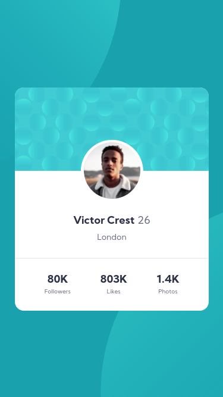
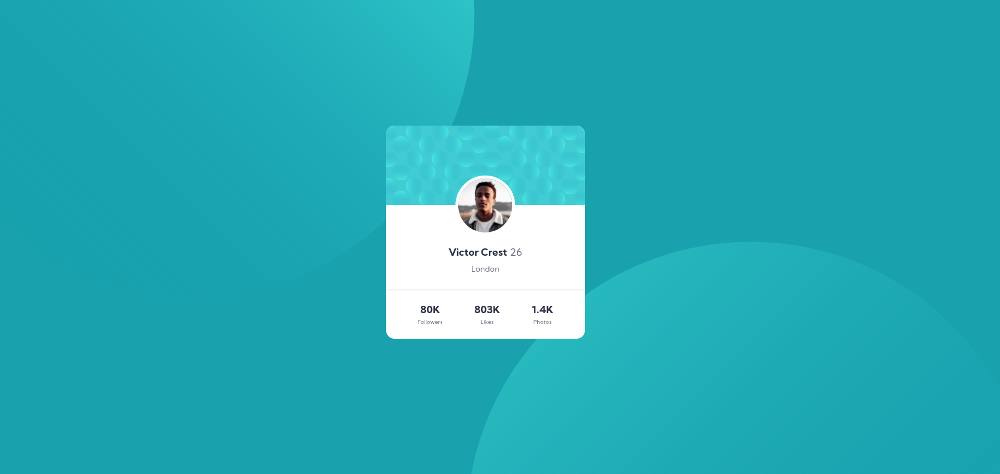

# Frontend Mentor - Profile card component solution

This is a solution to the [Profile card component challenge on Frontend Mentor](https://www.frontendmentor.io/challenges/profile-card-component-cfArpWshJ). Frontend Mentor challenges help you improve your coding skills by building realistic projects. 

## Table of contents

- [Overview](#overview)
  - [The challenge](#the-challenge)
  - [Screenshot](#screenshot)
  - [Links](#links)
- [My process](#my-process)
  - [Built with](#built-with)
  - [What I learned](#what-i-learned)
- [Author](#author)
- [Acknowledgments](#acknowledgments)

## Overview

### The challenge

- Build out the project to the designs provided

### Screenshot

### Links

- Solution URL: [https://www.frontendmentor.io/solutions/html-and-css-flexbox-ZKgPsq0QK](https://www.frontendmentor.io/solutions/html-and-css-flexbox-ZKgPsq0QK)
- Live Site URL: [https://priceless-goldwasser-65d74a.netlify.app/](https://priceless-goldwasser-65d74a.netlify.app/)

## My process

### Built with

- Semantic HTML5 markup
- CSS custom properties
- Flexbox
- Mobile-first workflow

### What I learned

Absolute and Relative positioning.

## Author

- Frontend Mentor - [@NoStackDev](https://www.frontendmentor.io/profile/NoStackDev)
- Twitter - [@NoStackDev](https://www.twitter.com/NoStackDev)

